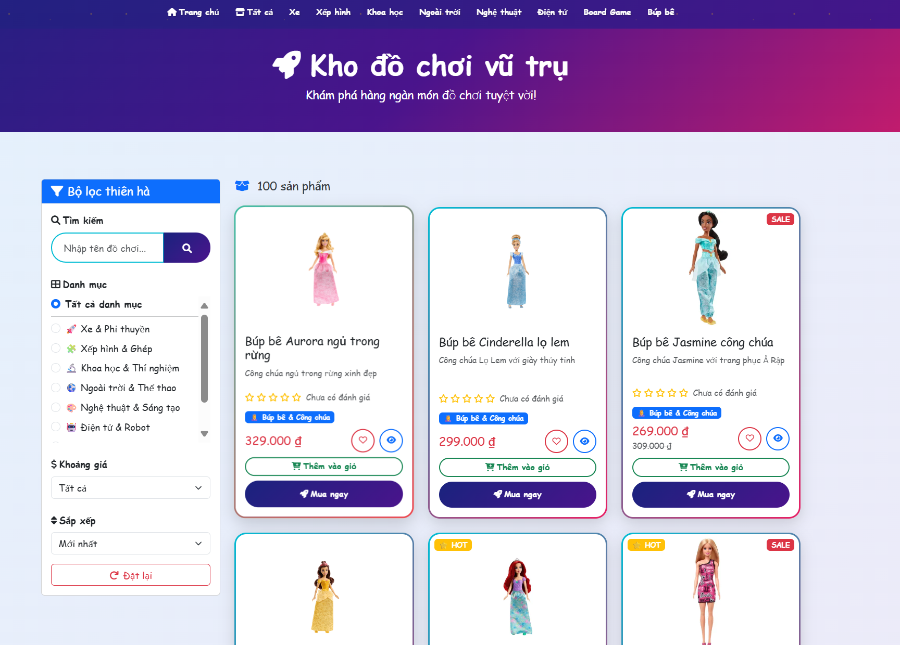
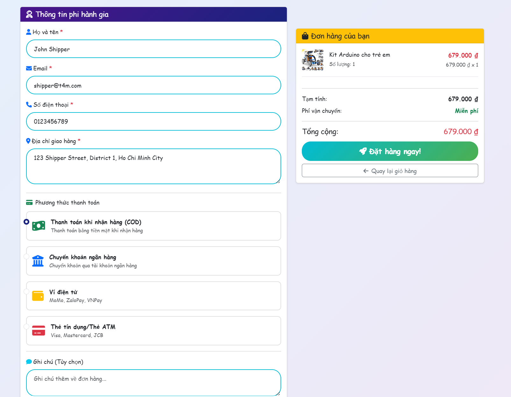
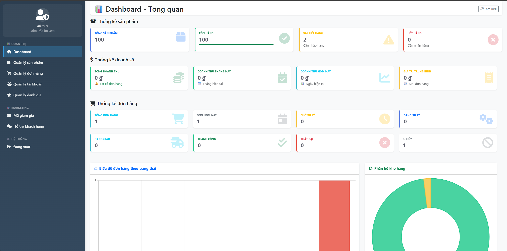
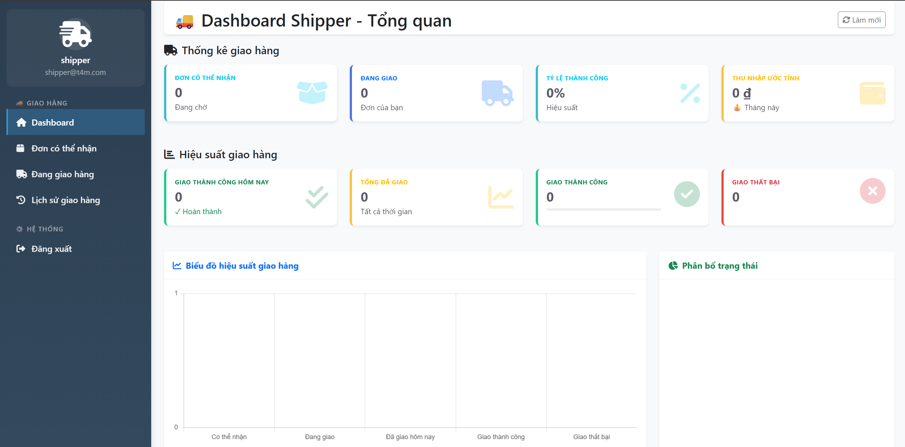

# T4M Toy Store

> **Đồ án môn học:** Lập trình Web (HK1 - Năm học 2025–2026)  
> **Đơn vị đào tạo:** Đại học Sư Phạm Kỹ Thuật TP.HCM (HCMUTE)  
> **Giảng viên hướng dẫn:** Nguyễn Hữu Trung  
> **Nhóm sinh viên thực hiện:** Nhóm 9 - T4M


---

## Thành viên nhóm

| Họ và Tên | Mã Sinh Viên | Liên hệ (Email) |
| :--- | :--- | :--- |
| Nguyễn Thanh Nhật | 23162072 | 23162072@student.hcmute.edu.vn |
| Trương Xuân Nhật | 23162073 | 23162073@student.hcmute.edu.vn |
| Ngô Tuấn Phát | 23162075 | 23162075@student.hcmute.edu.vn |
| Lê Văn Ánh Thông | 23162097 | 23162097@student.hcmute.edu.vn |

---

## Giới thiệu chung

**T4M Toy Store** là website thương mại điện tử bán đồ chơi, được phát triển bằng **Spring Boot**, **Thymeleaf** và **Bootstrap 5**.  
Hệ thống hỗ trợ ba vai trò chính: **Khách hàng**, **Quản trị viên**, và **Shipper**.  
Dự án tích hợp các công nghệ hiện đại như **AI Chatbot (Gemini)**, **thanh toán VNPay**, **chat thời gian thực (WebSocket)** và **upload ảnh Cloudinary** hướng đến trải nghiệm người dùng tối ưu.

---

## Cấu trúc thư mục

```bash
Toy-Store-Web/
├── src/
│   ├── main/
│   │   ├── java/t4m/toy_store/
│   │   │   ├── ToyStoreApplication.java
│   │   │   ├── admin/                    # Module admin
│   │   │   ├── auth/                     # Module xác thực
│   │   │   ├── cart/                     # Module giỏ hàng
│   │   │   ├── chatbot/                  # Module AI chatbot
│   │   │   ├── config/                   # Cấu hình Spring
│   │   │   ├── favorite/                 # Module yêu thích
│   │   │   ├── image/                    # Module upload ảnh
│   │   │   ├── main/                     # Module trang chủ
│   │   │   ├── order/                    # Module đơn hàng
│   │   │   ├── payment/                  # Module thanh toán
│   │   │   ├── product/                  # Module sản phẩm
│   │   │   ├── rating/                   # Module đánh giá
│   │   │   ├── shipper/                  # Module shipper
│   │   │   ├── support/                  # Module chat hỗ trợ
│   │   │   └── voucher/                  # Module mã giảm giá
│   │   ├── resources/
│   │   │   ├── templates/
│   │   │   │   ├── admin/
│   │   │   │   ├── shipper/
│   │   │   │   ├── email/
│   │   │   │   ├── fragments/
│   │   │   │   └── policies/
│   │   │   ├── static/
│   │   │   │   ├── css/
│   │   │   │   └── js/
│   │   │   └── application.properties
│   └── test/
├── pom.xml
├── mvnw / mvnw.cmd
└── README.md
```

---

## Tính năng chính

- Mua sắm sản phẩm với tìm kiếm, lọc, đánh giá
- Giỏ hàng và thanh toán VNPay
- Mã giảm giá động
- Chat thời gian thực với AI Chatbot
- Quản lý admin đầy đủ
- Quản lý shipper giao hàng
- Email xác thực OTP
- Upload ảnh Cloudinary
- Bảo mật JWT

---

## Tính năng chi tiết

### 1. Trang chủ & Mua sắm
Website sở hữu giao diện trang chủ hiện đại với các banner quảng cáo và sản phẩm nổi bật.


<!--  -->

**Tính năng mua sắm:**
- Tìm kiếm và lọc sản phẩm theo danh mục, giá cả
- Xem chi tiết sản phẩm với hình ảnh chất lượng cao
- Thêm sản phẩm vào giỏ hàng và yêu thích



### 2. Thanh toán & Đặt hàng
Hệ thống thanh toán an toàn với Nhiều phương thức thanh toán như COD, VNPay,... hỗ trợ đầy đủ quy trình mua hàng.



**Quy trình đặt hàng:**
- Kiểm tra giỏ hàng và điều chỉnh số lượng
- Nhập thông tin giao hàng chi tiết
- Thanh toán trực tuyến qua VNPay
- Nhận xác nhận đơn hàng qua email

### 3. Quản trị hệ thống (Admin)
Giao diện quản trị chuyên nghiệp với sidebar điều hướng rõ ràng.



**Chức năng quản lý:**
- **Sản phẩm**: Thêm/sửa/xóa sản phẩm, upload ảnh lên Cloudinary
- **Đơn hàng**: Theo dõi và cập nhật trạng thái giao hàng
- **Tài khoản**: Quản lý người dùng, phân quyền chi tiết
- **Mã giảm giá**: Tạo và quản lý các chương trình khuyến mãi
- **Đánh giá**: Xem và quản lý feedback từ khách hàng

### 4. Giao hàng (Shipper)
Giao diện dành riêng cho nhân viên giao hàng với các công cụ hỗ trợ.



**Tính năng giao hàng:**
- Xem danh sách đơn hàng cần giao
- Cập nhật trạng thái giao hàng theo thời gian thực
- Theo dõi vị trí giao hàng trên bản đồ
- Báo cáo hiệu suất và thống kê công việc

### 5. Tương tác & Hỗ trợ
Hệ thống tương tác đa dạng đảm bảo trải nghiệm tốt cho người dùng.


**Tính năng nổi bật:**
- **Chat thời gian thực**: Kết nối khách hàng với admin qua WebSocket
- **AI Chatbot**: Tư vấn tự động sử dụng Google Gemini
- **Email thông báo**: OTP xác thực, đặt lại mật khẩu, xác nhận đơn hàng
- **Đánh giá sản phẩm**: Hệ thống 5 sao với bình luận chi tiết

### 6. Bảo mật & An toàn
Hệ thống bảo mật toàn diện cho tất cả vai trò người dùng.

**Công nghệ bảo mật:**
- JWT Authentication cho xác thực an toàn
- BCrypt mã hóa mật khẩu
- Phân quyền chi tiết theo vai trò (Admin/User/Shipper)
- Bảo vệ chống SQL Injection và XSS

---

## Công nghệ sử dụng & Cấu hình

| Thành phần | Công nghệ | Phiên bản | Mô tả chi tiết |
| :--- | :--- | :--- | :--- |
| **Ngôn ngữ** | Java | 24 | Backend chính |
| **Framework** | Spring Boot | 3.5.5 | Kiến trúc MVC |
| **Template** | Thymeleaf | 3.1.2 | Kết xuất trang web |
| **UI** | Bootstrap 5 | 5.x | Responsive design |
| **Database** | MySQL | 8.0+ | Lưu trữ dữ liệu |
| **ORM** | Spring Data JPA | 3.5.5 | Repository pattern |
| **Bảo mật** | Spring Security | 6.x | Xác thực, phân quyền |
| **JWT** | JJWT | 0.9.1 | Token authentication |
| **Upload** | Cloudinary | 1.39.0 | Lưu trữ ảnh |
| **WebSocket** | Spring Messaging | 3.5.5 | Chat thời gian thực |
| **Thanh toán** | VNPay | Sandbox | Cổng thanh toán |
| **AI** | Google Gemini | Latest | Chatbot |
| **Email** | Spring Mail | 3.5.5 | Gửi email |
| **Build** | Maven | 3.6+ | Quản lý dự án |

---

## Cài đặt và Chạy dự án

### Yêu cầu Hệ thống

- Java Development Kit (JDK) 24
- Apache Maven 3.6+
- MySQL Server 8.0+
- IDE: IntelliJ IDEA, Eclipse hoặc VS Code

### Hướng Dẫn Cài Đặt

**Bước 1: Clone Repository**

```bash
git clone https://github.com/useristn/Toy-Store-Web.git
cd Toy-Store-Web
```

**Bước 2: Cấu hình Database**

```sql
CREATE DATABASE toy_store;
CREATE USER 'toyuser'@'localhost' IDENTIFIED BY 'toypass123';
GRANT ALL PRIVILEGES ON toy_store.* TO 'toyuser'@'localhost';
FLUSH PRIVILEGES;
```

**Bước 3: Cấu hình Application Properties**

Chỉnh sửa `src/main/resources/application.properties`:

```properties
spring.datasource.url=jdbc:mysql://localhost:3306/toy_store
spring.datasource.username=toyuser
spring.datasource.password=toypass123

spring.jpa.hibernate.ddl-auto=update

spring.mail.host=smtp.gmail.com
spring.mail.port=587
spring.mail.username=your_email@gmail.com
spring.mail.password=your_app_password

cloudinary.cloud-name=your_cloud_name
cloudinary.api-key=your_api_key
cloudinary.api-secret=your_api_secret

vnpay.tmn-code=YOUR_TMN_CODE
vnpay.hash-secret=YOUR_HASH_SECRET

gemini.api.key=your_gemini_api_key
```

**Bước 4: Chạy Ứng dụng**

```bash
mvn clean install
mvn spring-boot:run
```

Hoặc chạy từ IDE: Run ToyStoreApplication.java

**Bước 5: Truy cập Ứng dụng**

- Client: http://localhost:8080
- Admin: http://localhost:8080/admin
- Shipper: http://localhost:8080/shipper

### Tài khoản Demo

- Admin: `admin@t4m.com` / `admin123`
- Shipper: `shipper@t4m.com` / `shipper123`
- Customer: `user@t4m.com` / `user123`

---

## Liên hệ

- GVHD: Nguyễn Hữu Trung
- SVTH: Nhóm T4M
- Repository: https://github.com/useristn/Toy-Store-Web

---

*Đồ án Lập trình Web - Trường Đại Học Sư Phạm Kỹ Thuật TP. HCM*